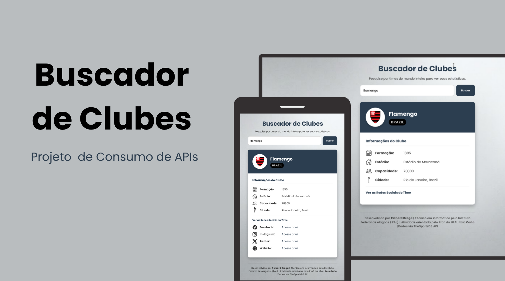
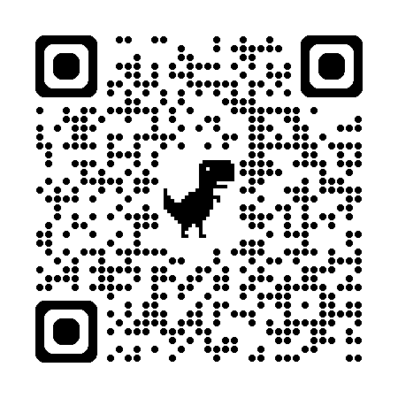

<h1 align="center"> Atividade: Buscador de Clubes - Consumo de APIs </h1>

Atividade promovida pelo professor da Universidade Federal de Alagoas (UFAL) <a href="https://github.com/italocarlo06">Ítalo Carlo</a> para ensino de tecnologias WEB.  

  <a href="#-tecnologias">Tecnologias</a>&nbsp;&nbsp;&nbsp;|&nbsp;&nbsp;&nbsp;
  <a href="#-projeto">Projeto</a>&nbsp;&nbsp;&nbsp;|&nbsp;&nbsp;&nbsp;
  <a href="#-layout">Layout</a>&nbsp;&nbsp;&nbsp;|&nbsp;&nbsp;&nbsp;
  <a href="#memo-licença">Licença</a>

  
  

 

  

## Tecnologias

Esse projeto foi desenvolvido com as seguintes tecnologias:

- HTML5 e CSS3
- JavaScript
- Git e Github
- TheSportsDB API
- Fetch API
- Canva

## Projeto

O **Buscador de Clubes** é uma aplicação WEB desenvolvida como atividade avaliativa para a disciplina PWEB proposta pelo professor **Italo Carlo** no **Instituto Federal de Alagoas**.

O objetivo é consolidar conceitos de desenvolvimento web através do consumo da API públic **TheSportsDB**. A aplicação permite que o usuário possa pesquisar qualquer time de futebol pelo nome e receba um card contendo os dados institucionais (estádio, redes sociais, e etc).

## Layout

Você pode visualizar o layout do projeto no Canva através [DESSE LINK](https://canva.link/8iernkr9f5eq9sk). Ou por este QR-code abaixo:

    

## Licença

Esse projeto está sob a licença MIT. Você é livre para:

- **Usar:** Utilizar o código para fins pessoais, acadêmicos ou comerciais.
- **Modificar:** Alterar, adaptar ou adicionar novas funcionalidades ao projeto.
- **Distribuir:** Compartilhar o código original ou suas modificações com outras pessoas.

